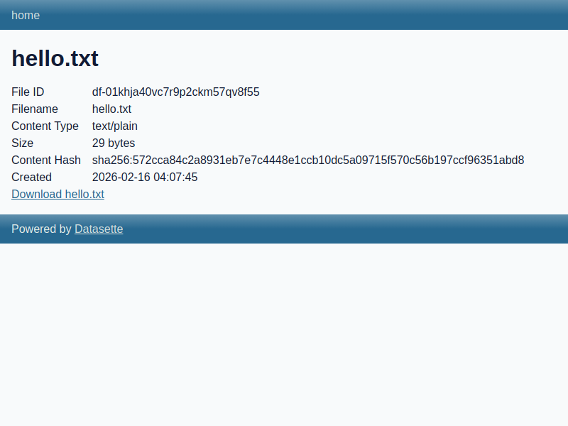
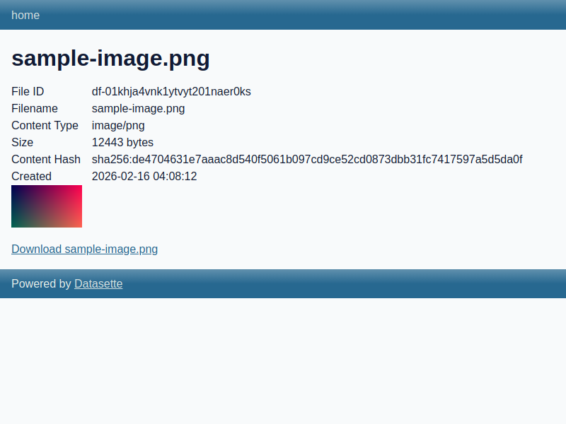
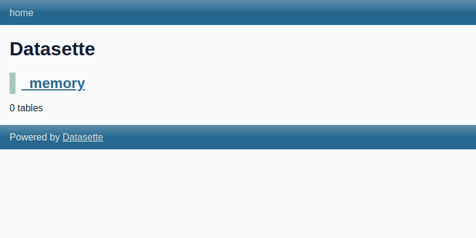

# datasette-files Filesystem Storage Demo

*2026-02-16T04:02:57Z by Showboat 0.5.0*

This demo walks through the `datasette-files` plugin with its built-in filesystem storage backend. We configure a source, upload files via the REST API, inspect file metadata, download files, and view the HTML file info pages in a browser.

## Setup

Configure datasette-files with a filesystem source called `demo-uploads` that stores files in a local directory:

```bash
cat demo-datasette.yaml
```

```output
plugins:
  datasette-files:
    sources:
      demo-uploads:
        storage: filesystem
        config:
          root: demo-uploads
```

Start Datasette with this configuration. We use an in-memory database and bind to port 8151:

```bash
curl -sf http://localhost:8151/ > /dev/null && echo "Datasette running on http://localhost:8151"
```

```output
Datasette running on http://localhost:8151
```

## Verify Plugin Installation

Confirm that datasette-files is installed and registered:

```bash
curl -s http://localhost:8151/-/plugins.json | python3 -m json.tool
```

```output
[
    {
        "name": "datasette-files",
        "static": false,
        "templates": true,
        "version": "0.1",
        "hooks": [
            "register_routes",
            "skip_csrf",
            "startup"
        ]
    }
]
```

## Sources API

The `/-/files/sources.json` endpoint lists all configured file sources and their capabilities:

```bash
curl -s http://localhost:8151/-/files/sources.json | python3 -m json.tool
```

```output
{
    "sources": [
        {
            "slug": "demo-uploads",
            "storage_type": "filesystem",
            "capabilities": {
                "can_upload": true,
                "can_delete": true,
                "can_list": true,
                "can_generate_signed_urls": false,
                "requires_proxy_download": true
            }
        }
    ]
}
```

The filesystem storage backend supports uploading, deleting, and listing files. Since it cannot generate signed URLs, file downloads are proxied through Datasette.

## Uploading Files

Upload a text file to the `demo-uploads` source using a multipart POST request:

```bash
echo "Hello from datasette-files\!" > /tmp/hello.txt
curl -s -X POST http://localhost:8151/-/files/upload/demo-uploads \
  -F "file=@/tmp/hello.txt;type=text/plain" | python3 -m json.tool
```

```output
{
    "file_id": "df-01khja40vc7r9p2ckm57qv8f55",
    "filename": "hello.txt",
    "content_type": "text/plain",
    "size": 29,
    "url": "/-/files/df-01khja40vc7r9p2ckm57qv8f55"
}
```

The response includes a unique `df-{ULID}` file ID, the original filename, content type, size in bytes, and a URL to the file info page.

Now upload an image to demonstrate image handling:

```bash
curl -s -X POST http://localhost:8151/-/files/upload/demo-uploads \
  -F "file=@/tmp/sample-image.png;type=image/png" | python3 -m json.tool
```

```output
{
    "file_id": "df-01khja4vnk1ytvyt201naer0ks",
    "filename": "sample-image.png",
    "content_type": "image/png",
    "size": 12443,
    "url": "/-/files/df-01khja4vnk1ytvyt201naer0ks"
}
```

## File Metadata

Retrieve metadata for an uploaded file as JSON by appending `.json` to the file URL:

```bash
curl -s http://localhost:8151/-/files/df-01khja40vc7r9p2ckm57qv8f55.json | python3 -m json.tool
```

```output
{
    "id": "df-01khja40vc7r9p2ckm57qv8f55",
    "source_id": 1,
    "path": "01khja40vc7r9p2ckm57qv8f55/hello.txt",
    "filename": "hello.txt",
    "content_type": "text/plain",
    "content_hash": "sha256:572cca84c2a8931eb7e7c4448e1ccb10dc5a09715f570c56b197ccf96351abd8",
    "size": 29,
    "width": null,
    "height": null,
    "uploaded_by": null,
    "created_at": "2026-02-16 04:07:45",
    "metadata": "{}",
    "source_slug": "demo-uploads"
}
```

The metadata includes the storage path (`{ulid}/{filename}`), a SHA-256 content hash for integrity verification, the original filename, content type, and creation timestamp.

## Downloading Files

Download a file via the `/download` endpoint:

```bash
curl -s http://localhost:8151/-/files/df-01khja40vc7r9p2ckm57qv8f55/download
```

```output
Hello from datasette-files\!
```

The download endpoint streams the file content directly through Datasette (since filesystem storage uses proxy downloads). The response includes the correct `Content-Type` header and a `Content-Disposition` header with the filename.

Check the response headers:

```bash
curl -sI http://localhost:8151/-/files/df-01khja40vc7r9p2ckm57qv8f55/download | head -6
```

```output
HTTP/1.1 200 OK
date: Mon, 16 Feb 2026 04:09:10 GMT
server: uvicorn
Content-Disposition: inline; filename="hello.txt"
content-type: text/plain
Transfer-Encoding: chunked
```

## File Info Page (Browser UI)

Each file has an HTML info page at `/-/files/{file_id}` showing metadata and a download link. For text files:

```bash {image}
/tmp/text-file-info.png
```



For image files, the info page includes an inline preview:

```bash {image}
/tmp/image-file-info.png
```



The image preview is loaded directly from the `/-/files/{file_id}/download` endpoint and displayed inline on the info page.

## Error Handling

Requesting a non-existent file returns a 404:

```bash
curl -s -o /dev/null -w "HTTP %{http_code}" http://localhost:8151/-/files/df-nonexistent
```

```output
HTTP 404```
```

Uploading to a non-existent source also returns a 404:

```bash
curl -s -o /dev/null -w "HTTP %{http_code}" -X POST http://localhost:8151/-/files/upload/nonexistent \
  -F "file=@/tmp/hello.txt;type=text/plain"
```

```output
HTTP 404```
```

## Storage on Disk

Files are stored in the configured root directory, organized by ULID subdirectories that match the file ID:

```bash
find /home/user/datasette-files/demos/demo-uploads -type f | sort
```

```output
/home/user/datasette-files/demos/demo-uploads/01khja40vc7r9p2ckm57qv8f55/hello.txt
/home/user/datasette-files/demos/demo-uploads/01khja4vnk1ytvyt201naer0ks/sample-image.png
```

Each file gets its own ULID-named directory, preserving the original filename within it. The file ID `df-01khja40vc7r9p2ckm57qv8f55` maps to the directory `01khja40vc7r9p2ckm57qv8f55/` (the `df-` prefix is stripped). This ensures unique storage paths even when uploading files with the same name.

## Datasette Home Page

The plugin integrates into Datasette's standard UI:

```bash {image}
/tmp/datasette-home.png
```



## Internal Database

The plugin stores file metadata in Datasette's internal database. The `datasette_files_sources` table tracks configured sources, and `datasette_files` stores records for every managed file. This separation means file metadata is queryable with SQL while actual file content lives on the storage backend.

## Cleanup

```bash
kill $(lsof -ti:8151) 2>/dev/null && echo "Datasette stopped" || echo "Already stopped"
```

```output
Datasette stopped
```
