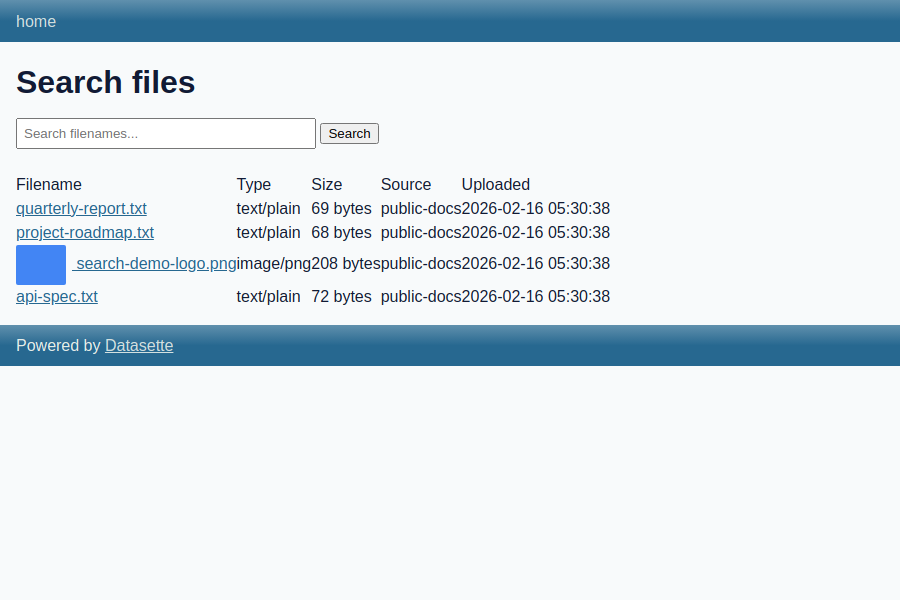
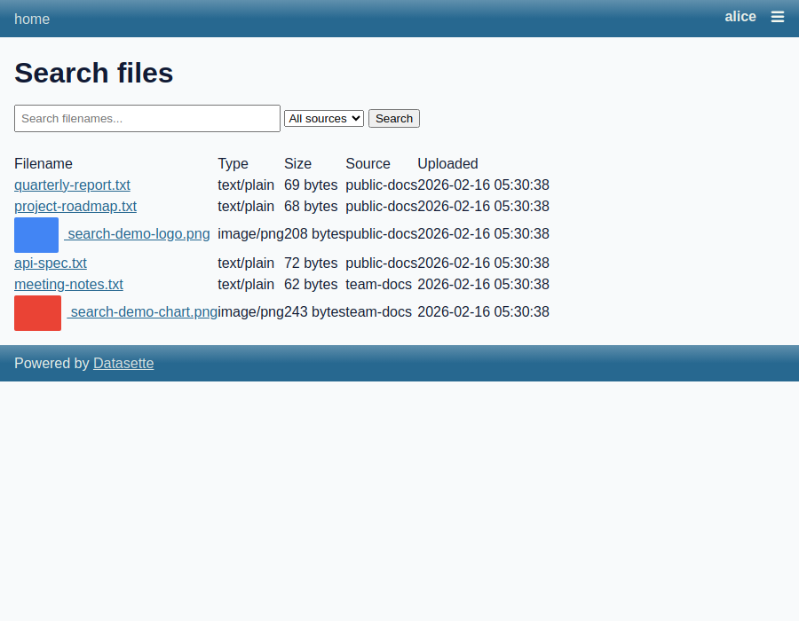
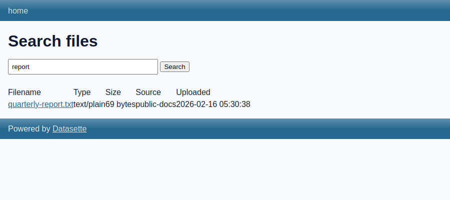

# Search UI with Permission-Filtered Results

*2026-02-16T05:26:55Z by Showboat 0.5.0*

This demo shows the search endpoint (`/-/files/search`) and how Datasette's SQL permission system filters results by source. Two file sources are configured: `public-docs` (browsable by everyone) and `team-docs` (restricted to alice). The search endpoint uses FTS5 for full-text search and Datasette's `allowed_resources_sql()` to filter results to only sources the current actor can browse.

## Configuration

Two sources with different permissions: `public-docs` allows everyone, `team-docs` requires actor id `alice`.

```bash
cat search-demo-datasette.yaml
```

```output
plugins:
  datasette-files:
    sources:
      public-docs:
        storage: filesystem
        config:
          root: search-demo-uploads/public
      team-docs:
        storage: filesystem
        config:
          root: search-demo-uploads/team

permissions:
  files-browse:
    public-docs:
      allow: true
    team-docs:
      allow:
        id: alice
```

The `permissions` block uses the per-source format. Under `files-browse`, each source slug maps to an allow block. `public-docs` has `allow: true` (anyone), while `team-docs` requires `id: alice`. With no default allow, all other actors are denied.

## Verify Actions Registered

The plugin registers three actions with Datasette's permission system:

```bash
curl -s http://localhost:8151/-/plugins.json | python3 -m json.tool
```

```output
[
    {
        "name": "datasette-files",
        "static": true,
        "templates": true,
        "version": "0.1",
        "hooks": [
            "extra_js_urls",
            "permission_resources_sql",
            "register_actions",
            "register_routes",
            "render_cell",
            "skip_csrf",
            "startup"
        ]
    }
]
```

The plugin now implements `register_actions` (registering `files-browse`, `files-upload`, `files-delete`) and `permission_resources_sql` (processing per-source permission config).

## Files Uploaded

Six files have been uploaded across the two sources: four to `public-docs` and two to `team-docs`.

```bash
curl -s 'http://localhost:8151/-/files/search.json' | python3 -m json.tool
```

```output
{
    "q": "",
    "source": "",
    "files": [
        {
            "id": "df-01khjem5yfp24z4832qa5tyvaz",
            "filename": "api-spec.txt",
            "content_type": "text/plain",
            "size": 72,
            "width": null,
            "height": null,
            "created_at": "2026-02-16 05:26:29",
            "uploaded_by": null,
            "source_slug": "public-docs"
        },
        {
            "id": "df-01khjem5p7gaycj8zams85m5k7",
            "filename": "quarterly-report.txt",
            "content_type": "text/plain",
            "size": 69,
            "width": null,
            "height": null,
            "created_at": "2026-02-16 05:26:28",
            "uploaded_by": null,
            "source_slug": "public-docs"
        },
        {
            "id": "df-01khjem5s05ycqp70ymycx5qwh",
            "filename": "project-roadmap.txt",
            "content_type": "text/plain",
            "size": 68,
            "width": null,
            "height": null,
            "created_at": "2026-02-16 05:26:28",
            "uploaded_by": null,
            "source_slug": "public-docs"
        },
        {
            "id": "df-01khjem5vsm9t29ck8zyyedcqy",
            "filename": "search-demo-logo.png",
            "content_type": "image/png",
            "size": 208,
            "width": null,
            "height": null,
            "created_at": "2026-02-16 05:26:28",
            "uploaded_by": null,
            "source_slug": "public-docs"
        }
    ],
    "sources": [
        "public-docs"
    ]
}
```

Anonymous users see only the 4 files from `public-docs`. The `sources` array confirms only `public-docs` is browsable. The 2 files in `team-docs` are invisible.

## FTS Search

The search endpoint uses FTS5 to match filenames. Searching for "report" finds only matching files in browsable sources:

```bash
curl -s 'http://localhost:8151/-/files/search.json?q=report' | python3 -m json.tool
```

```output
{
    "q": "report",
    "source": "",
    "files": [
        {
            "id": "df-01khjem5p7gaycj8zams85m5k7",
            "filename": "quarterly-report.txt",
            "content_type": "text/plain",
            "size": 69,
            "width": null,
            "height": null,
            "created_at": "2026-02-16 05:26:28",
            "uploaded_by": null,
            "source_slug": "public-docs"
        }
    ],
    "sources": [
        "public-docs"
    ]
}
```

FTS5 matched `quarterly-report.txt` by filename. The index covers `filename` and `content_type` columns.

## Permission-Filtered Access (Alice)

When alice authenticates, she can browse both sources. The `ds_actor` cookie carries a signed actor token:

```bash
curl -s -b 'ds_actor=eyJhIjp7ImlkIjoiYWxpY2UifX0.i9Yqd9XCWop22Fkk0e9lmLj1VCk' 'http://localhost:8151/-/files/search.json' | python3 -m json.tool
```

```output
{
    "q": "",
    "source": "",
    "files": [
        {
            "id": "df-01khjevsa8fg5ke5n41rs4yq2e",
            "filename": "quarterly-report.txt",
            "content_type": "text/plain",
            "size": 69,
            "width": null,
            "height": null,
            "created_at": "2026-02-16 05:30:38",
            "uploaded_by": null,
            "source_slug": "public-docs"
        },
        {
            "id": "df-01khjevsbcp88xmxpy8wxa865y",
            "filename": "project-roadmap.txt",
            "content_type": "text/plain",
            "size": 68,
            "width": null,
            "height": null,
            "created_at": "2026-02-16 05:30:38",
            "uploaded_by": null,
            "source_slug": "public-docs"
        },
        {
            "id": "df-01khjevscewnsgwvxxwptjd6p5",
            "filename": "search-demo-logo.png",
            "content_type": "image/png",
            "size": 208,
            "width": null,
            "height": null,
            "created_at": "2026-02-16 05:30:38",
            "uploaded_by": null,
            "source_slug": "public-docs"
        },
        {
            "id": "df-01khjevsdfpm0d9vra7ya1cn9v",
            "filename": "api-spec.txt",
            "content_type": "text/plain",
            "size": 72,
            "width": null,
            "height": null,
            "created_at": "2026-02-16 05:30:38",
            "uploaded_by": null,
            "source_slug": "public-docs"
        },
        {
            "id": "df-01khjevsenq8529w89hv52189r",
            "filename": "meeting-notes.txt",
            "content_type": "text/plain",
            "size": 62,
            "width": null,
            "height": null,
            "created_at": "2026-02-16 05:30:38",
            "uploaded_by": null,
            "source_slug": "team-docs"
        },
        {
            "id": "df-01khjevsfqjyp213286b4cxn3h",
            "filename": "search-demo-chart.png",
            "content_type": "image/png",
            "size": 243,
            "width": null,
            "height": null,
            "created_at": "2026-02-16 05:30:38",
            "uploaded_by": null,
            "source_slug": "team-docs"
        }
    ],
    "sources": [
        "public-docs",
        "team-docs"
    ]
}
```

Alice sees all 6 files across both `public-docs` and `team-docs`, and `sources` lists both as browsable. Compare this with anonymous access above, which only shows the 4 public files.

## Search HTML UI

The search page at `/-/files/search` provides a search box with source filter dropdown and results table.

```bash {image}

```



Anonymous users see 4 files, all from `public-docs`. The source filter dropdown shows only `public-docs` since that is the only browsable source.

When alice is authenticated, she sees files from both sources and the dropdown includes both `public-docs` and `team-docs`:

```bash {image}

```



## FTS Search in Action

Searching for "report" matches the filename `quarterly-report.txt`:

```bash {image}

```



## Permission Enforcement on File Pages

Without `files-browse` permission, even direct URLs to file info or download endpoints return 403:

```bash
curl -s -o /dev/null -w 'HTTP %{http_code}' http://localhost:8151/-/files/df-01khjevsenq8529w89hv52189r
```

```output
HTTP 403```
```

Anonymous user gets HTTP 403 on the team-docs file. Alice can access it:

```bash
curl -s -b 'ds_actor=eyJhIjp7ImlkIjoiYWxpY2UifX0.i9Yqd9XCWop22Fkk0e9lmLj1VCk' -o /dev/null -w 'HTTP %{http_code}' http://localhost:8151/-/files/df-01khjevsenq8529w89hv52189r
```

```output
HTTP 200```
```

Alice gets HTTP 200 because she has `files-browse` permission on `team-docs`. The same permission check applies to the `.json` metadata endpoint and `/download` endpoint.

## How It Works

1. **`FileSourceResource`** registers file sources as a top-level resource type in Datasette's permission system, with `resources_sql()` returning all source slugs from the internal database
2. **`register_actions`** defines `files-browse`, `files-upload`, and `files-delete` actions scoped to `FileSourceResource` (all default deny)
3. **`permission_resources_sql`** reads the `permissions:` config block and emits `PermissionSQL` rules for each source
4. **Search endpoint** calls `allowed_resources_sql()` to get browsable sources, then filters FTS/listing queries to those sources
5. **Individual file endpoints** call `datasette.allowed()` to check `files-browse` on the file's source before serving content

## Cleanup

```bash
kill $(lsof -ti:8151) 2>/dev/null && echo "Datasette stopped" || echo "Already stopped"
```

```output
Datasette stopped
```
