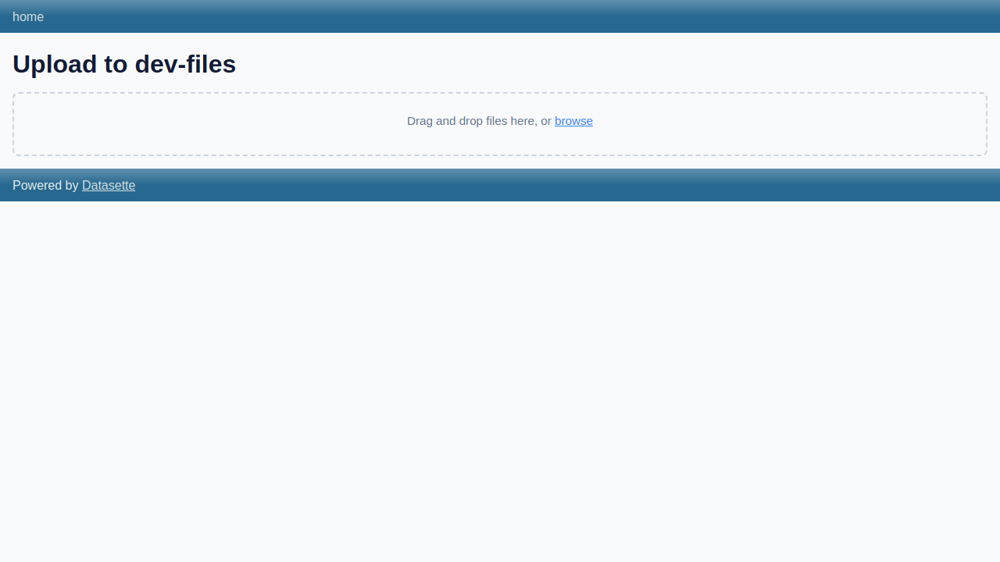
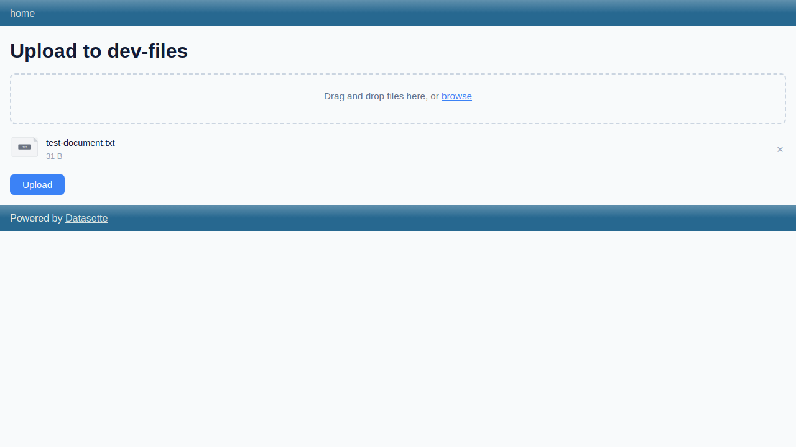
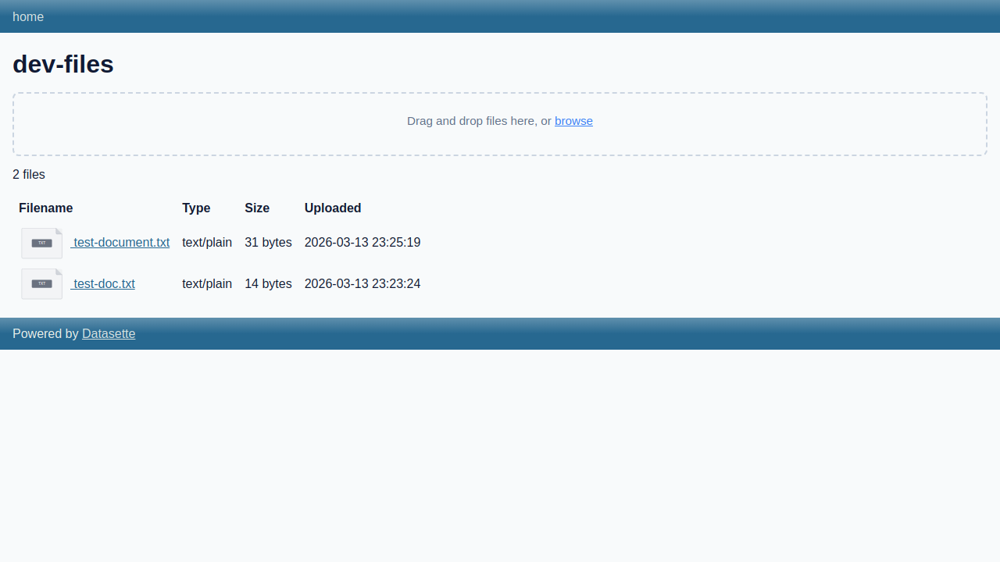
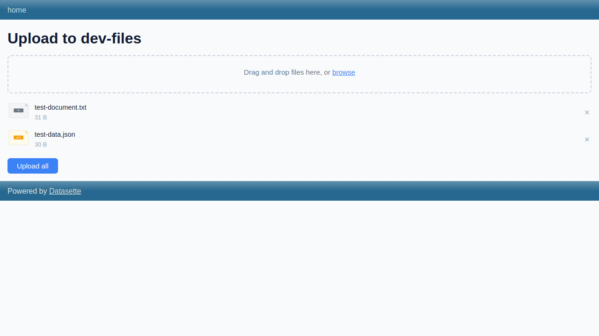
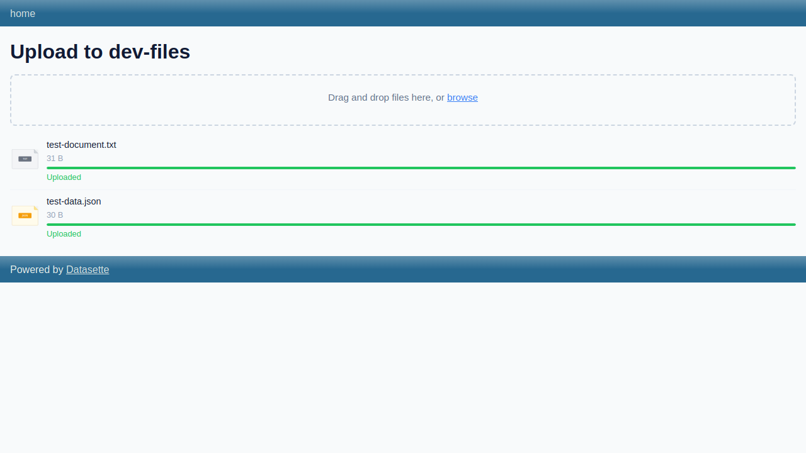
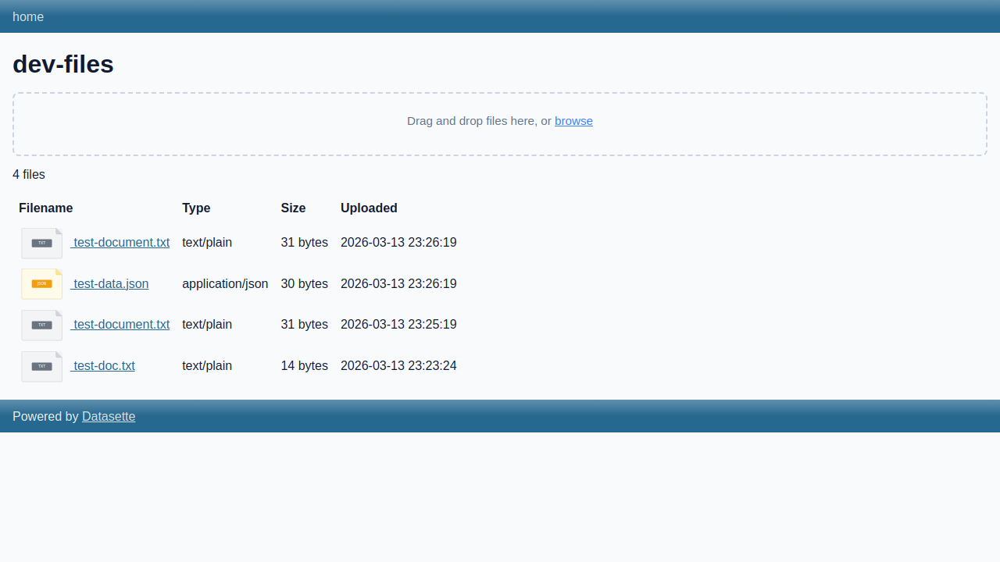

# Upload UI Demo

*2026-03-13T23:22:50Z by Showboat 0.6.1*
<!-- showboat-id: cf0deffb-29e0-4c92-979d-98109647f9a1 -->

Testing the new drag-and-drop multi-file upload UI. Starting the Datasette dev server and using rodney for browser automation.

```bash
curl -s http://localhost:8099/-/files/sources.json | python3 -m json.tool
```

```output
{
    "sources": [
        {
            "slug": "dev-files",
            "storage_type": "filesystem",
            "capabilities": {
                "can_upload": true,
                "can_delete": true,
                "can_list": true,
                "can_generate_signed_urls": false,
                "requires_proxy_download": true
            }
        }
    ]
}
```

Testing the three-step upload API flow: prepare, content, complete.

```bash

# Step 1: Prepare
PREP=$(curl -s -X POST http://localhost:8099/-/files/upload/dev-files/-/prepare \
  -H "Content-Type: application/json" \
  -d "{\"filename\": \"test-doc.txt\", \"content_type\": \"text/plain\", \"size\": 13}")
echo "Prepare response:"
echo "$PREP" | python3 -m json.tool
TOKEN=$(echo "$PREP" | python3 -c "import sys,json; print(json.load(sys.stdin)[\"upload_token\"])")

# Step 2: Upload content
echo -e "\nContent upload response:"
curl -s -X POST http://localhost:8099/-/files/upload/dev-files/-/content \
  -F "upload_token=$TOKEN" \
  -F "file=@-;filename=test-doc.txt;type=text/plain" <<< "Hello, world!" | python3 -m json.tool

# Step 3: Complete
echo -e "\nComplete response:"
curl -s -X POST http://localhost:8099/-/files/upload/dev-files/-/complete \
  -H "Content-Type: application/json" \
  -d "{\"upload_token\": \"$TOKEN\"}" | python3 -m json.tool

```

```output
Prepare response:
{
    "ok": true,
    "upload_token": "tok_01kkmr61cjhtem426zas4dmd3g",
    "upload_url": "/-/files/upload/dev-files/-/content",
    "upload_method": "POST",
    "upload_headers": {},
    "upload_fields": {
        "upload_token": "tok_01kkmr61cjhtem426zas4dmd3g"
    }
}

Content upload response:
{
    "ok": true
}

Complete response:
{
    "ok": true,
    "file": {
        "id": "df-01kkmr61cjhtem426zas4dmd3f",
        "filename": "test-doc.txt",
        "content_type": "text/plain",
        "content_hash": "sha256:d9014c4624844aa5bac314773d6b689ad467fa4e1d1a50a1b8a99d5a95f72ff5",
        "size": 14,
        "width": null,
        "height": null,
        "source_slug": "dev-files",
        "uploaded_by": null,
        "created_at": "2026-03-13 23:23:24",
        "url": "/-/files/df-01kkmr61cjhtem426zas4dmd3f",
        "download_url": "/-/files/df-01kkmr61cjhtem426zas4dmd3f/download"
    }
}
```

The upload page shows a drag-and-drop area with dashed border. When files are selected, they appear in a list with SVG file-type icons, filename, size, and a remove button.

```bash {image}

```



After selecting a file, it appears in the file list with a TXT file icon, the filename, file size, and an Upload button.

```bash {image}

```



The source page shows the upload component at the top and a table of existing files below, each with SVG file icons.

```bash {image}

```



With multiple files selected, the button changes to 'Upload all'. Each file shows its own SVG icon based on file type (TXT = grey, JSON = orange).

```bash {image}

```



After clicking 'Upload all', each file shows a green progress bar at 100% and 'Uploaded' status text.

```bash {image}

```



The source page shows all uploaded files in a table with SVG file-type icons, filenames as links, MIME types, sizes, and upload timestamps.

```bash {image}

```



Testing the delete API endpoint.

```bash

# Get file IDs
FILES=$(curl -s "http://localhost:8099/-/files/search.json" | python3 -c "
import sys,json
data = json.load(sys.stdin)
for f in data[\"files\"]:
    print(f[\"id\"], f[\"filename\"])
")
echo "Files before delete:"
echo "$FILES"

# Delete the first file
FIRST_ID=$(echo "$FILES" | head -1 | cut -d" " -f1)
echo -e "\nDeleting $FIRST_ID..."
curl -s -X POST "http://localhost:8099/-/files/$FIRST_ID/-/delete" \
  -H "Content-Type: application/json" \
  -d "{}" | python3 -m json.tool

echo -e "\nFiles after delete:"
curl -s "http://localhost:8099/-/files/search.json" | python3 -c "
import sys,json
data = json.load(sys.stdin)
for f in data[\"files\"]:
    print(f[\"id\"], f[\"filename\"])
"

```

```output
Files before delete:
df-01kkmrbd2nf1szhfn8ch4ta9nz test-document.txt
df-01kkmrbd364sw6gecrxdfb66ad test-data.json
df-01kkmr9j8gxwj6m7t7v39qdat4 test-document.txt
df-01kkmr61cjhtem426zas4dmd3f test-doc.txt

Deleting df-01kkmrbd2nf1szhfn8ch4ta9nz...
{
    "ok": true
}

Files after delete:
df-01kkmrbd364sw6gecrxdfb66ad test-data.json
df-01kkmr9j8gxwj6m7t7v39qdat4 test-document.txt
df-01kkmr61cjhtem426zas4dmd3f test-doc.txt
```

Testing the update API endpoint.

```bash

FILE_ID=$(curl -s "http://localhost:8099/-/files/search.json" | python3 -c "import sys,json; print(json.load(sys.stdin)[\"files\"][0][\"id\"])")
echo "Updating search_text for $FILE_ID..."
curl -s -X POST "http://localhost:8099/-/files/$FILE_ID/-/update" \
  -H "Content-Type: application/json" \
  -d "{\"update\": {\"search_text\": \"Important quarterly report data\"}}" | python3 -m json.tool

echo -e "\nSearching for updated text:"
curl -s "http://localhost:8099/-/files/search.json?q=quarterly" | python3 -c "
import sys,json
data = json.load(sys.stdin)
for f in data[\"files\"]:
    print(f[\"id\"], f[\"filename\"])
"

```

```output
Updating search_text for df-01kkmrbd364sw6gecrxdfb66ad...
{
    "ok": true,
    "file": {
        "id": "df-01kkmrbd364sw6gecrxdfb66ad",
        "source_id": 1,
        "path": "01kkmrbd364sw6gecrxdfb66ad/test-data.json",
        "filename": "test-data.json",
        "content_type": "application/json",
        "content_hash": "sha256:74c2ce6a1f7821cd1149ce2675a6d8c5afd7da84266dd8122e31a0ecf9ea52a1",
        "size": 30,
        "width": null,
        "height": null,
        "uploaded_by": null,
        "created_at": "2026-03-13 23:26:19",
        "metadata": "{}",
        "search_text": "Important quarterly report data",
        "source_slug": "dev-files"
    }
}

Searching for updated text:
df-01kkmrbd364sw6gecrxdfb66ad test-data.json
```
